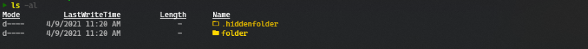
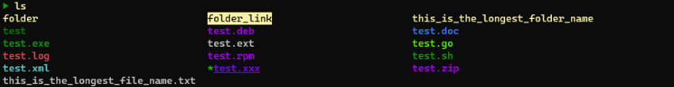
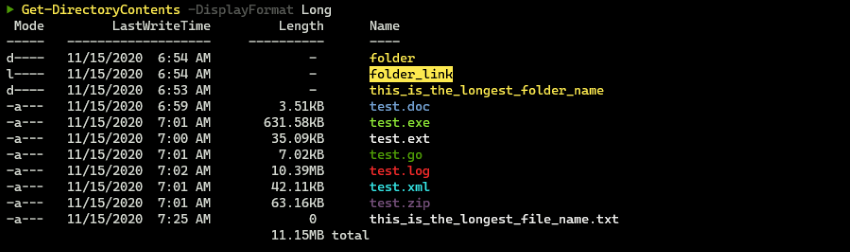
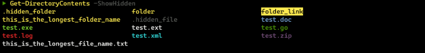
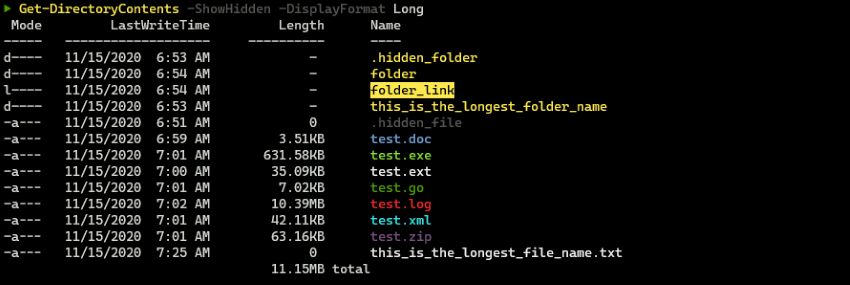
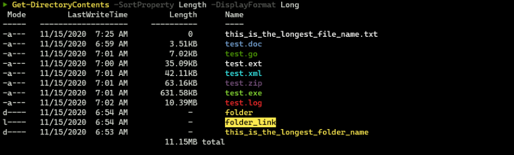

# WieldingLs

Table of Contents
=================

- [WieldingLs](#wieldingls)
- [Table of Contents](#table-of-contents)
- [Introduction](#introduction)
- [Main Function](#main-function)
  - [Get-DirectoryContents](#get-directorycontents)
  - [Examples:](#examples)
  - [Customization](#customization)
  - [Example overrides](#example-overrides)
  - [Sample Output](#sample-output)

Introduction
============
This is a Powershell module which aims for basic **nix* `ls` compatibility with the ability to customize the colors and styles of the displayed filenames. 

:warning: This is a work in progress so the master branch could break your Powershell profile if you customize any of the settings.:warning: 

For Windows users this module requires a minimum of Windows 10 1903.  When using this module under Windows please use [Windows Terminal](https://github.com/microsoft/terminal).  Any other console may give unpredictable results and might not work at all.

This module has been tested under WSL and seems to work fine but more testing is required to back up that claim.

This module depends on the [WieldingAnsi](https://github.com/Wielding/WieldingAnsi) Powershell module for handling ANSI escape codes which enables colors and styles that are *nix compatible.

Inspired by and occasionally borrowed from https://github.com/joonro/Get-ChildItemColor. 

There is more work to be done. Here are the known limitations and planned enhancements.
1. File attribute handling needs to be enhanced for Non-Windows systems.  This prevents the ability to identify 'executable' files on those systems since they don't rely on file extensions. 
   * A workaround for this is to use $GdcTheme.NakedFileColor.  This is a special color for all files without an extension. This is not a great solution but it is better than nothing since most files have an extension.
   * So far all attempts to read **nix* file attributes are unacceptably slow for large directory listings.
2. You can't pipe output from this command as objects since it is just returning text.  This is just for formatting your directory listing nicely.  If you need to pipe file objects just use `Get-ChildItem`.
3. There is a slight delay when listing large folders in the default `Short` format since the module has to retrieve a list of all of the files before displaying them. This is necessary to format them in columns determined by the length of the longest filename and can't be helped.
4. This list will grow since I have not done any real testing on Non-Windows systems.

Main Function
==============

Get-DirectoryContents
---------------------
The current command line parameters are:
* `-DisplayFormat` -
  The format to display files.  Must be one of `"Long"`, `"Short"`. The default value is `"Short"`.

* `-l` -
  The same as `-DisplayFormat Long`.  

* `-SortProperty` -
  The file property to sort on.  Must be one of `"Name"`, `"Attributes"`, `"LastWriteTime"`, `"Length"`. The default sort method is to display files in the native order from Get-ChildItem.

* `-HideHeader` -
  Disables displaying the directory list header. The default value is False.

* `-MinColumns` -
  The minumum number of columns to display in short format before truncating filenames. The default value is 4.  

* `-HideTotal` -
  Disables displaying the file size total. The default value is False.

* `-ShowHidden` | `-a` -
  Enables displaying files that start with `"."` and\or have the `Hidden` attribute. The default value is False.

* `-ShowSystem` | `-w` -
  Enables displaying files with the `System` attribute. The default value is False.  

* `-NoColor` -
  Disables colorizing output. The default value is False.  

The parameters `-l, -a` and` -w` can be combined in any order into a single parameter.  For example
```powershell
Get-DirectoryContents -la
```

-and-

```powershell
Get-DirectoryContents -al
```

will enable `ShowHidden + DisplayFormat Long`.


Examples:
---------
Display all files in users home directory including files starting with "." and with the Hidden attribute set.
```powershell
Get-DirectoryContents -ShowHidden ~
```

Display all files in current directory sorted by name
```powershell
Get-DirectoryContents -SortProperty Name
```

To use this module place the file Get-DirectoryContents.psm1 in you user Powershell Modules folder.

On Windows this would be something like `~\Documents\PowerShell\Modules\Get-DirectoryContents`.

On **nix* I usually use `~/.local/share/powershell/Modules/Get-DirectoryContents`

You can inspect your module locations with `$Env:PSModulePath` to verify where you can place the module.

If the folder does not exist create it.

If you want to be able to easily keep it up to date you can use git to clone https://github.com/Wielding/Get-DirectoryContents under `~\Documents\PowerShell\Modules `

I will look into adding this module to the Powershell gallery once it has been fully tested across platforms.

After that, add the following line to your Powershell profile:

```powershell
Import-Module Get-DirectoryContents
```

Customization
-------------
This module uses ANSI color and format codes to apply styles to your filenames.  I have picked my defaults which can be overridden in your Powershell profile. All styles are represented by strings which are interpreted by the [WieldingAnsi](https://github.com/Wielding/WieldingAnsi) Powershell module.  

To see the colors and styles that can be used type `Get-AnsiCodes` on the command line after you have imported the module to see what is available.  The attributes and a color table will be displayed with the foreground colors starting with an 'F' and background colors starting with a 'B' (e.g. `"{:F7:}"` is a 'white' foreground color).

You can also set and clear Bold, Inverse and Underline styles using these values.

1. Bold - `"{:BoldOn:}` : `"{:BoldOff:}"`
2. Underline - `"{:UnderlineOn:}"` : `"{:UnderlineOff:}"`
3. Inverse - `"{:InverseOn:}"` : `"{:InverseOff:}"`

To reset a style to the default for the console use the value `"{:R:}"`

All of the styles that can be overridded are contained in the exported `$GdcTheme` class.

Here are the group colors, styles and defaults that can be overridden with the current defaults
```powershell
$GdcTheme.SourceCodeColor = "{:F82:}"
$GdcTheme.DataFileColor = "{:F14:}"
$GdcTheme.GDCLogFileColor = "{:F9:}"
$GdcTheme.CompressedFileColor = "{:F129:}"
$GdcTheme.ExecutableFileColor = "{:F2:}"
$GdcTheme.DocumentFileColor = "{:F12:}"
$GdcTheme.HiddenFileColor = "{:F240:}"
$GdcTheme.HiddenFolderColor = "{:F136:}"
$GdcTheme.NakedFileColor = "{:F28:}"
$GdcTheme.DefaultFileColor = "{:R:}"
$GdcTheme.FileAttributesColors["Directory"] = "{:F11:}"
$GdcTheme.FileAttributesColors["ReparsePoint"] = "{:F0:}{:B11:}"
$GdcTheme.DefaultDisplayFormat = "Short"
```
You can add or override specific extensions with the variable:
```powershell
$GdcTheme.ExtensionColors
```

You can override specific file attributes with the variable:
```powershell
$GdcTheme.FileAttributesColors
```

Example overrides
---
Here are some examples of overriding the defaults by placing some code in your Powershell profile.

The following will change the default display format to `Long`
```powershell
Import-Module WieldingLs
$GdcTheme.DefaultDisplayFormat="Long"
```

The following will change all files categorized as Data Files to be shown with a Dark Magenta foreground color, the default background color and underlined.  Note that `'Update-GDCColors'` needs to be called after modifying a category.
```powershell
Import-Module WieldingLs
$GdcTheme.DataFileColor = "{:F13:}{:UnderlineOn:}"
Update-GDCColors
```
The following will cause all files with a '.xxx' extension to be shown with an underlined Purple foreground.  It will also have a Green '*' preceding the filename. You can add characters to the start of any filename but keep it to a single character.  It might throw off the column formatting if it gets too long. Calling `Update-GDCColors` is not required here since we are directly setting the extension color outside of any category.
```powershell
Import-Module WieldingLs
$GdcTheme.ExtensionColors[".xxx"] = "{:F40:}*{:F93:}{:UnderlineOn:}"
```

You can put folder icons in front of directory items if you are using [NerdFonts](https://www.nerdfonts.com) in your terminal by putting the following in your profile.
```powershell
$GdcTheme.FileAttributesColors["Directory"] = "{:F220:}$([char]0xf74a) "
$GdcTheme.FileAttributesColors["ReparsePoint"] = "{:F0:}{:B220:}$([char]0xf756) "
$GdcTheme.HiddenFolderColor = "{:F178:}$([char]0xf755) "
```
Here is an example of the folder icons.


Here is a sample with the ".xxx" styling from above using the alias `ls` set to `Get-DirectoryContents`


The following will show files with a '.pl1' extension to show as if it was in the 'Source Code' category.
```powershell
Import-Module WieldingLs
$GdcTheme.ExtensionColors[".pl1"] = $GdcTheme.SourceCodeColor
```
The following will also show files with a ".pl1" extension with the color for 'Source Code' but this requires a call to `Update-GDCColors` since we are adding the extension to the category.
```powershell
Import-Module WieldingLs
$GdcTheme.SourceCodeExtensions += ".pl1"
Update-GDCColors
```

If you would like to set many extensions to the same color you could use the following.
```powershell
Import-Module WieldingLs
 (".ext1", ".ext2", ".ext3") | ForEach-Object {$GdcTheme.ExtensionColors[$_] = "{:F4:}"}
```
This would set ".ext1", ".ext2" and ".ext3" to a forground color of `"{:F4:}"`

If you want to see what your current extensions styles are you can enter the following on the command line to get a list of the extensions in the style that is assigned to each.

```powershell
$GdcTheme.ExtensionColors.Keys | Sort-Object $_ |  % {Write-Wansi "$($GdcTheme.ExtensionColors[$_])$_{:R:}`n"}
```

The following will change all files with the `Directory` attribute to be shown with a `Blue` foreground and the default background.
```powershell
Import-Module WieldingLs
$GdcTheme.FileAttributesColors["Directory"] = "{:F4:}"
```
You can look at the code in `Get-DirectoryContents.pms1` to see the default file extension values as well as the exported values that can be overridden or modified.

Another option for customizing is saving the `$GdcTheme` class contents to a file.  You can save the current state of the theme using the following powershell code.

```powershell
  Set-Content -Path ./theme.json (ConvertTo-Json -InputObject $GdcTheme -Depth 10)
```

This will save the current state of your theme including any modifcations you have made using the previous methods to the file `theme.json` in the current directory.

You can now edit that file as JSON and then reload it to `$GdcThem` with the following code at the top of your powershell profile.

```powershell
Import-Module WieldingLs
$GdcTheme = (Get-Content ./theme.json | ConvertFrom-Json -AsHashtable)
```


Sample Output
-------------






For ease of use I also add the following to my Powershell profile to override the default Powershell alias for `ls`.
```powershell
Set-Alias -Name ls -Value Get-DirectoryContents
```

